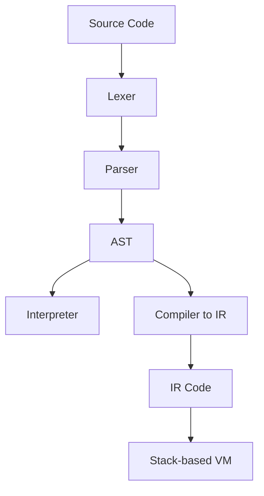

# 🌀 Hybrid-Compiler-Interpreter

A simple **interpreter + compiler** framework for a toy language with C-like syntax, built in C++.  
It demonstrates a complete **programming language pipeline** from **lexical analysis** to **execution via interpretation or a stack-based virtual machine**.

> ⚡ Ideal for learning how interpreters, parsers, ASTs, and compilers work.

---

## 🚀 Features

- ✅ Lexical analysis (tokenizer)
- ✅ Recursive descent parser
- ✅ AST construction
- ✅ AST-based interpreter
- ✅ Compiler to custom IR
- ✅ Stack-based virtual machine (VM) executor
- ✅ Constant folding + dead code elimination (basic optimizations)

---

## 🗂️ Project Structure

```
Hybrid/
├── main.cpp              # Entry point: CLI, interpreter/compiler runner
├── lexer.h / lexer.cpp   # Lexer: Tokenizes input source code
├── parser.h / parser.cpp # Parser: Recursive descent parser + AST builder
├── interpreter.h / .cpp  # Interpreter: Walks and evaluates AST
├── ir.h                  # IR representation + VM + compiler logic
├── test.cpp              # Sample toy-language program
├── input.cpp             # (Unused) Example C++ input
├── hybrid.exe            # Compiled binary for full pipeline
├── interpreter.exe       # Optional: only interpreter
├── test2.cpp / test3.cpp / test4.cpp # More sample inputs
```

---

## 🧠 Language Syntax (Toy Language)

- Variables and assignments: `x = 5;`
- Arithmetic: `x = x + 1;`
- Conditionals: `if (x == 5) { ... } else { ... }`
- Loops: `while (x < 10) { ... }`
- Print: `print x;`

### ✨ Example

```js
x = 0;
y = 5;
while (x < y) {
    if (x == 2) {
        y = y - 1;
    } else {
        y = y - 2;
    }
    print x;
    x = x + 1;
}
```

---

## 🔧 How to Build

> ⚠️ Requires `g++` (C++17 or later)

### 🖥️ On Windows (Command Prompt)

```sh
g++ main.cpp lexer.cpp parser.cpp interpreter.cpp -o hybrid.exe
```

### 🐧 On Linux

```sh
g++ main.cpp lexer.cpp parser.cpp interpreter.cpp -o hybrid
```

### 🛠 Optional: Split binaries
To build interpreter or IR VM separately:

```sh
g++ interpreter.cpp parser.cpp lexer.cpp -o interpreter
```

---

## 💻 How to Run

```sh
./hybrid test.cpp
```

### 📋 You'll be prompted to:
- Choose **Interpretation**, **Compilation**, or **Both**
- See output from either AST interpreter or stack-based VM

---

## 🔍 How It Works

### 📌 Pipeline



### 🛠 Components

| Stage        | File(s)         | Description |
|--------------|------------------|-------------|
| Lexer        | `lexer.cpp/h`    | Tokenizes the input |
| Parser       | `parser.cpp/h`   | Builds AST using recursive descent |
| Interpreter  | `interpreter.cpp/h` | Walks AST and evaluates it |
| Compiler + VM| `ir.h`           | Generates IR and executes with stack-based VM |
| Main         | `main.cpp`       | CLI logic, input reading, execution |

---

## 🧠 Optimization Support

Implemented in `parser.cpp` via `optimizeAST()`:
- ✅ Constant folding (e.g., `2 + 3` → `5`)
- ✅ Dead code removal (e.g., `while (0) {...}` → removed)
- ✅ Simplified conditionals (`if (1)` → executes only "then" block)

To add more optimizations, extend `optimizeAST()` in `parser.cpp`.

---

## 🧪 Test Programs

Use sample programs in:
- `test.cpp`
- `test2.cpp`
- `test3.cpp`
- `test4.cpp`

Each demonstrates loops, conditionals, and arithmetic.

---

## 🤝 Contributing

Feel free to fork and contribute:
- Add support for new types (`float`, `bool`, `string`)
- Implement functions / scoping
- Improve the VM with a better instruction set
- Add more IR-level optimizations

---

## 📝 License

MIT License — use freely for learning and extension.

---

## 👨‍💻 Author

Made by Gautam Singh Jyala

---
